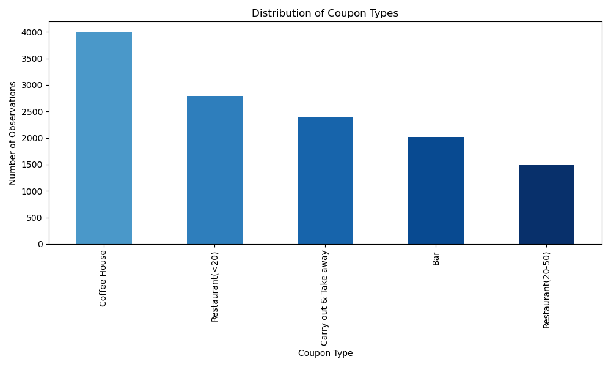
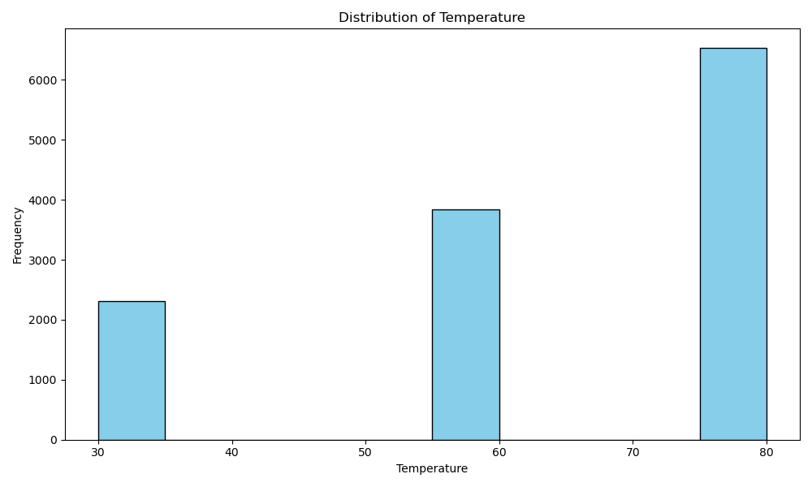
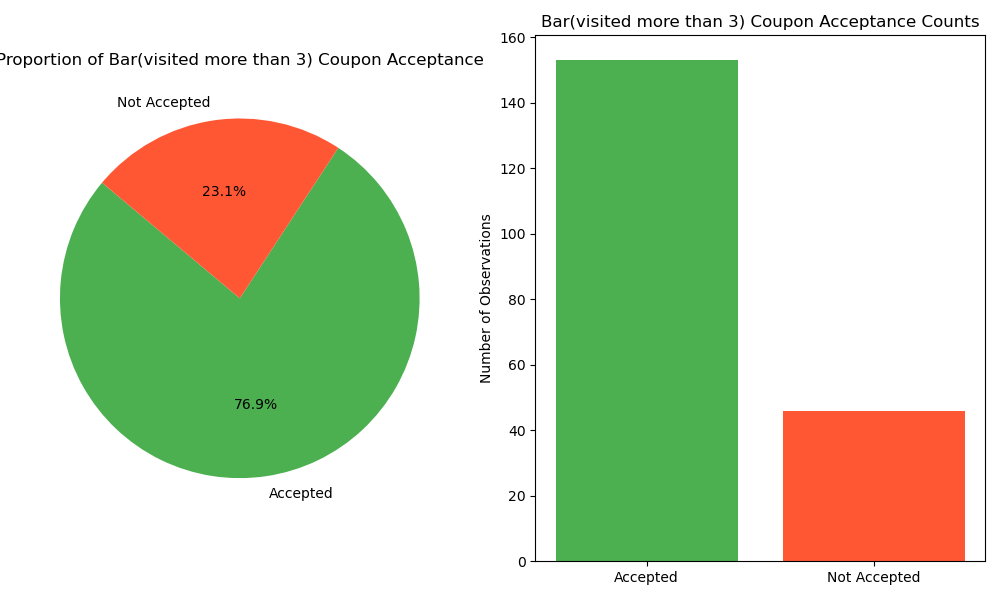
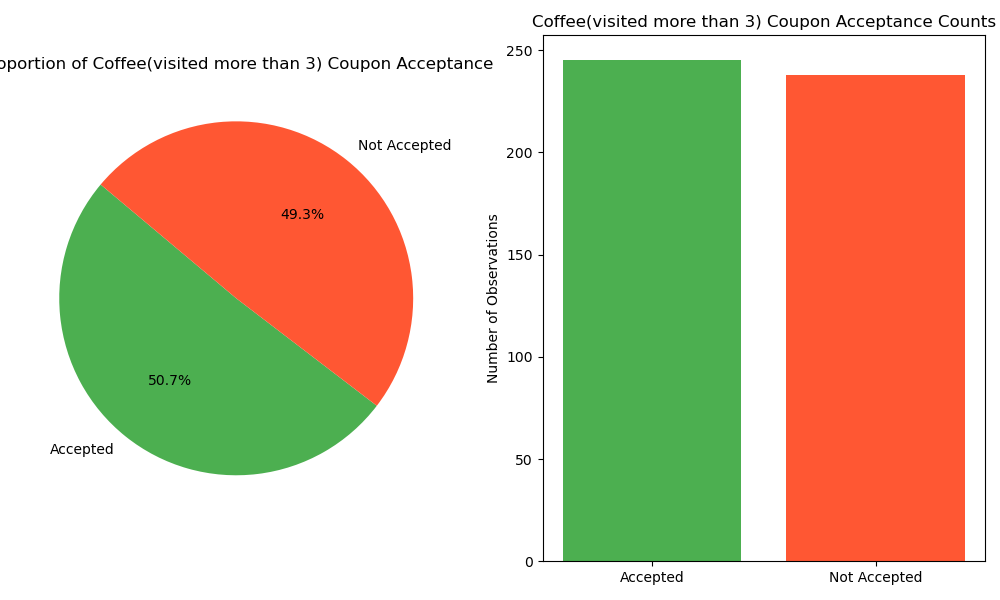
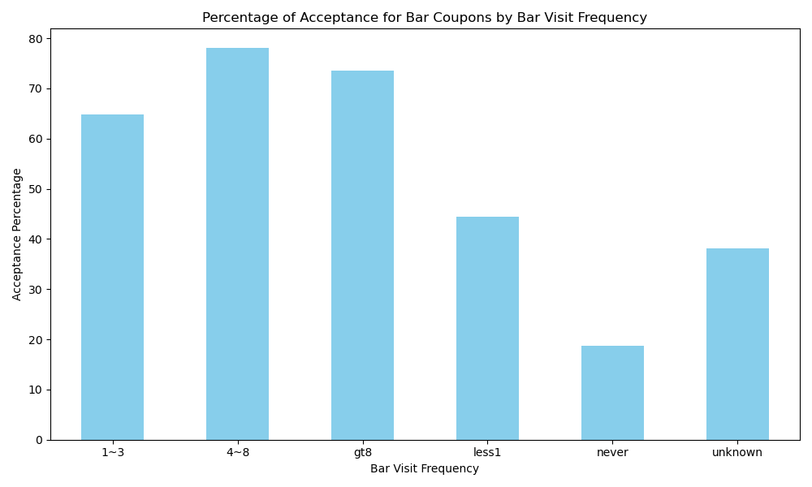
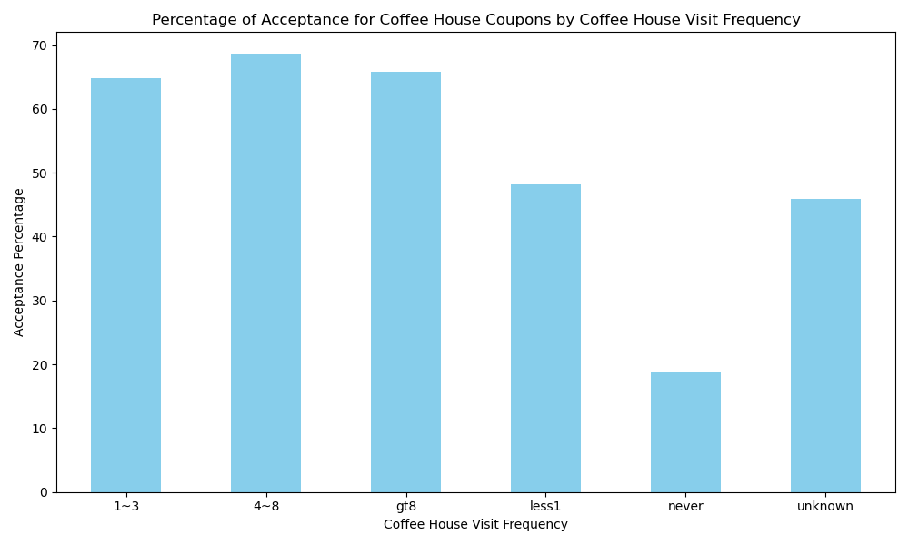
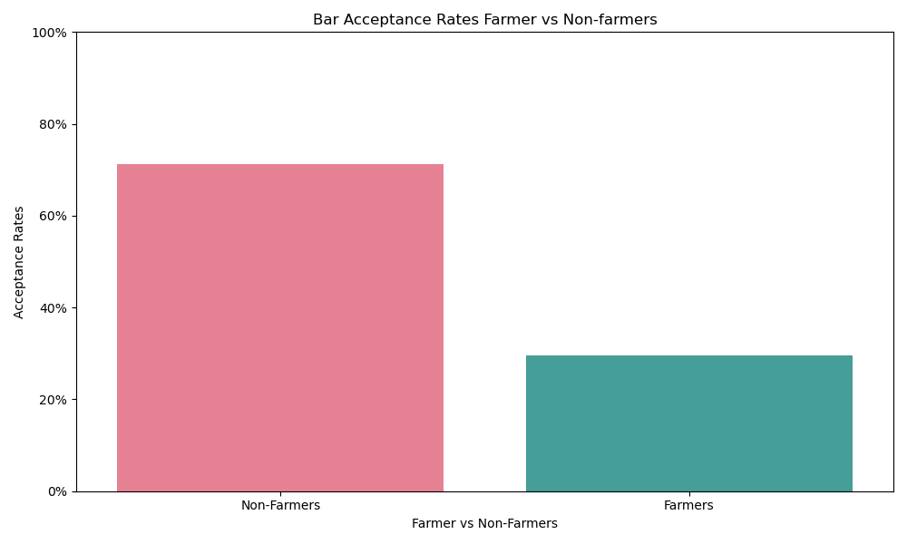
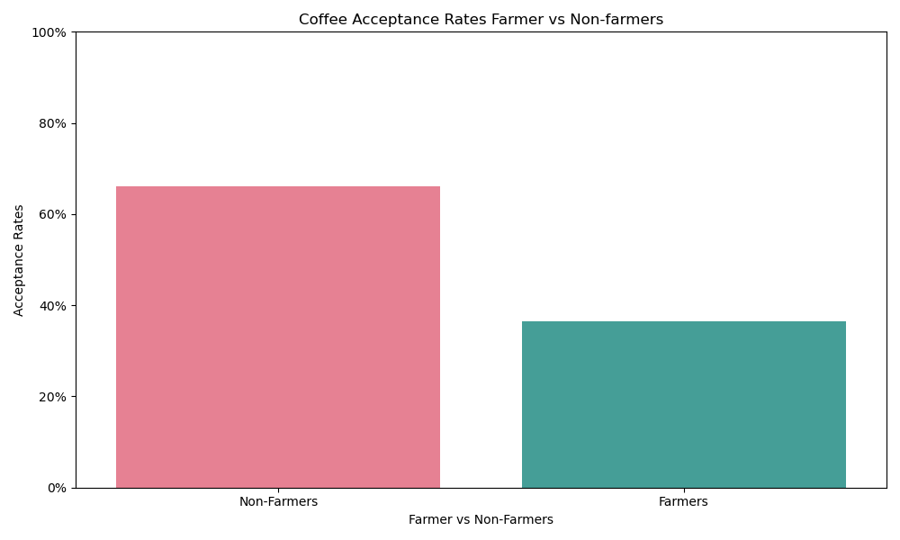

# Practical Application Assignment 5.1

## Context

This project is an analysis of data from the UCI Machine Learning repository that was collected via a survey on Amazon Mechanical Turk. The survey describes different driving scenarios including the destination, current time, weather, passenger, etc., and then asks the person whether he will accept a discount coupon if he is the driver was presented with it under specific circumstnaces. 

## Data Cleanliness

The is first step of analyzing this data was to review it for any anomallies. In doing this I was able to determing a few things.
1. The 'car' column, which was to be used to tell which car a driver had, was almost completely empty. There were only 108 non-null entries. For this reason I chose to drop the entire column as there was not enough data for it to be useful

2. The 'Bar','CoffeeHouse', 'CarryAway',  'RestaurantLessThan20', 'Restaurant20To50' columns all had null values. In this case I chose to keep these rows, but to fill the missing values with 'unknown'. This allowed me too leverage all of the responses when my plots did not depend on visit frequency. I eventually dropped the null rows before analysing data to answer questions that did depend on frequency.
Bar                       107 nulls
CoffeeHouse               217 nulls
CarryAway                 151 nulls
RestaurantLessThan20      130 nulls
Restaurant20To50          189 nulls

3. Finally I updated the names of the columns to follow a consisten snake_case format.

## General Data Analysis

The proportion of the total observations that chose to accept the coupon was 56.8%. This is show in the figure below.

The distribution of the number of observations can be seen below. Coffee House had the highest response rate.

The distribution of the tempature can be seen below. Most responses were greater than 50 degrees

## Bar and Coffee Shop Coupon Analysis

An exploration of Bar and Coffee Shop coupon acceptance rates, comparing age, fequency of visiting bar, occupation and vehicle occupants. 

### Summary
Overall, the 2 features that seemed to impact acceptance rates the most were occupation and frequency. Bar seemed to be more impacted by frequency than Coffee Shop. In this chart you can see that the acceptance rate of drivers that visit bars more than 3 times is nearly 80%. 

Further investigation showed that there is indeed a higher acceptance rate depending on the frequency of visits. For coffee shops, the acceptance rates went up for vists more than 1.

We were also able to see that occupation, specifically whether or not they are farmer or fishermen, plays a signficant role.

### Next Steps

Given these preliminary findings, the next steps would be to look at which occupations have the higher acceptance rates. Cross-referencing a few other features like urgency and direction would be helpful. In this data set, we would need to validate that there are no underlying features that are skewing the data. In addition, we would need to see if there is a correlation between farmers and how often they visit bars or coffee shops. 